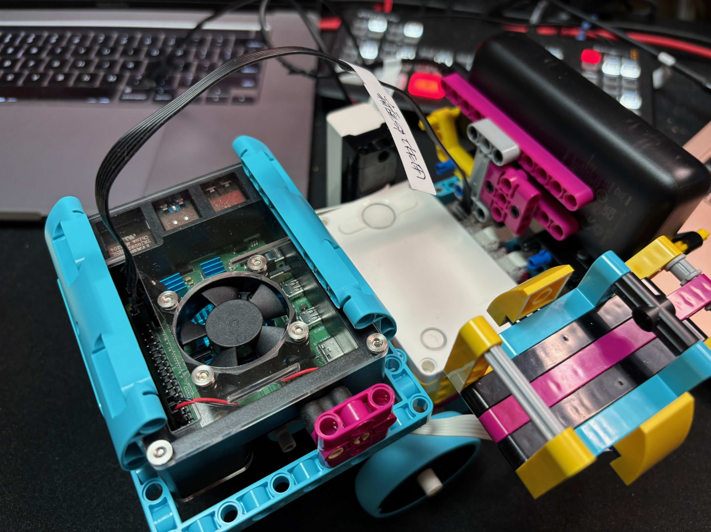
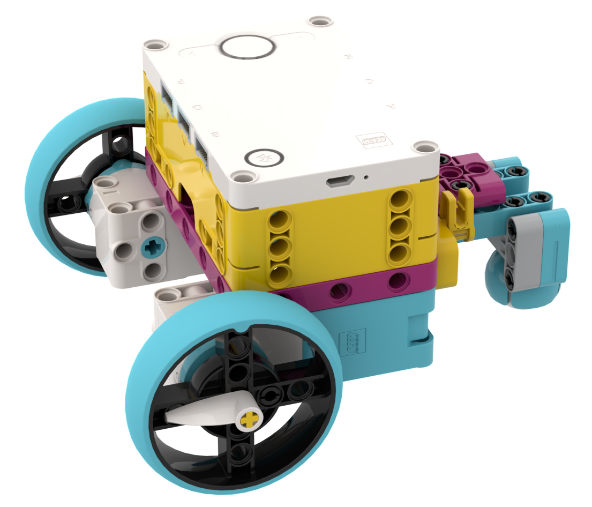
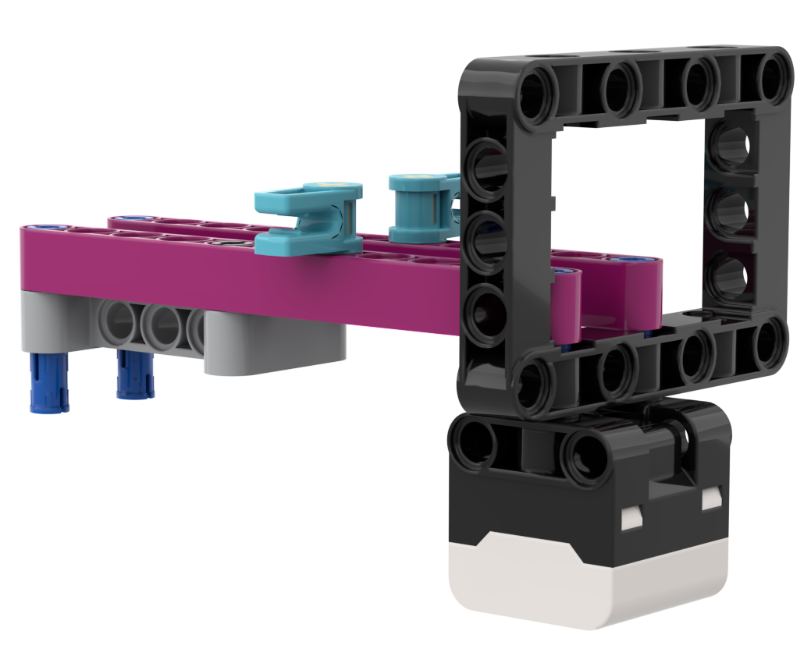
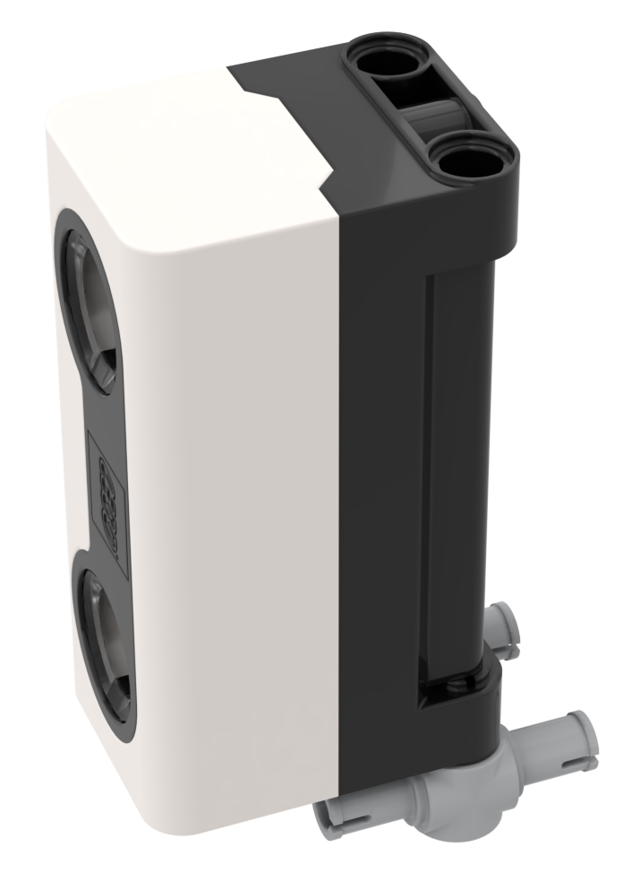
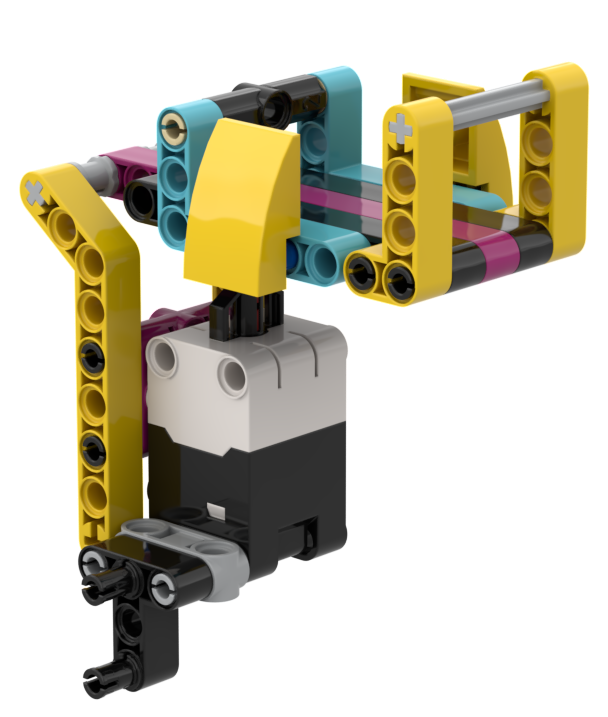
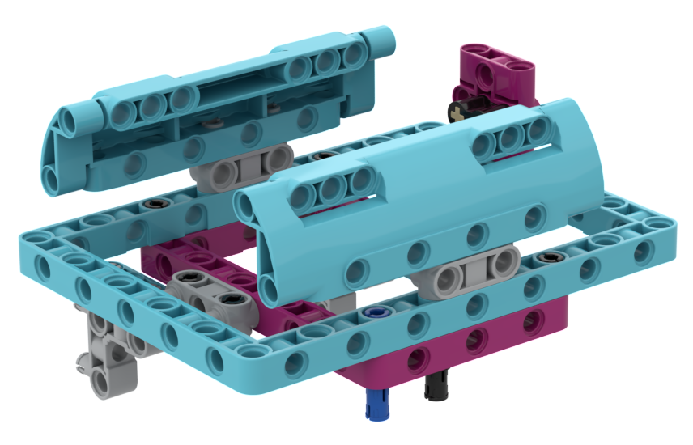
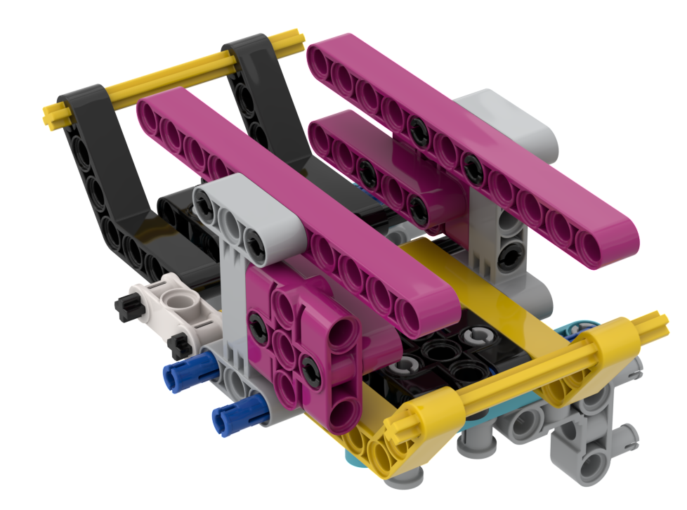
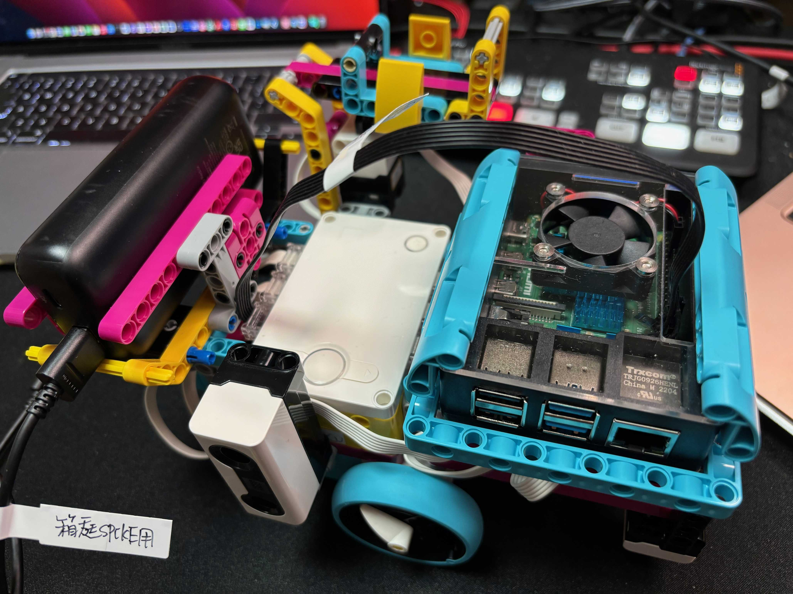
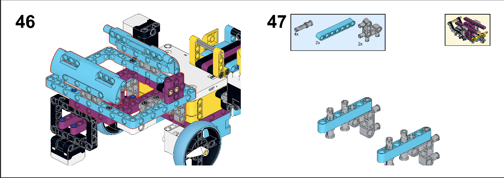

[English](link:README.html[]) | [日本語](link:README_ja.html[])

== SPIKE RasPi Transporter

[.lead]
"Spike Raspi Transporter" is the auto transportation vehicle using LEGO SPIKE PRIME <<spike>>  kit and Raspberry Pi 4 <<raspi>> .

[NOTE]
****
Check the version created using only the SPIKE PRIME kit from the link below.

* https://github.com/kuboaki/spike_transporter.git[Spike Trasporter, window=_blank]
****

.Trasnporter using LEGO SPIKE PRIME kit and Raspberry Pi 4

=== Motivation

I used the LEGO Mindstorms EV3 <<ev3>> kit to build an auto transporter and use it in lectures and training.
However, EV3 will be discontinued in 2021 and will be difficult to obtain in the future.
Therefore, I decided to create a similar transporter "Spike Transporter" using the LEGO SPIKE PRIME kit, which is the successor product.

=== Structure of spike transporter

This vehicle consists of several units.

==== Base unit

The base unit is a drive unit that runs on two main wheels and a rear ball.

This unit is used a SPIKE's large hub and two medium motors.

.Base unit

==== Line monitor

The line monitor unit is watcher the transportation route(black line) for the transporter running.

This unit is used a SPIKE's color sensor.

.Line monitor

==== Wall Detector

The wall detector unit recognizes side walls of delivery destinations and garages.

This unit is used a SPIKE's ultrasonic sensor.

.Wall detecotor

==== Carrier and Container

The carrier unit is a place where cargo (container) is loaded. It monitors whether there is cargo or not.

The carrier unit is used  SPIKE's force sensor (like a touch sensor).

[cols="1,1",frame=none,grid=none]
|===
a|.Carrier

a|.Cargo(Container)
image::images/spike_transporter_container.png[width="80%"]
|===

==== Raspberry Pi mounter

This unit is for mouting Raspberry Pi.
Depending on your case, you may need to make some changes.

.Raspberry Pi mounter

==== Battery mounter

This unit is for mouting mobile battery.
Depending on your battery, you may need to make some changes.

.Battery mounter

==== Overview

The following figure shows how all units are connected.

.Spike Raspi Transporter
image::images/spike_raspi_transporter_all.png[width="50%"]

After mounting the Raspberry Pi and mobile battery, it will look like the following figure.

[cols="1,1",frame=none,grid=none]
|===
a|.Spike Raspi Transporter(left)

a|.Spike Raspi Transporter(right)

|===

=== Building instruction

Building instruction were created using "Bricklink Studio".

* link:images/spike_raspi_transporter_instructions.pdf[Spike Raspi Transporter Instruction（PDF）]

.sample pages of the building instruction

=== Development environment and Program

(under construction...)

=== Contents structure

[source,console]
----
spike_raspi_transporter
├── images: LEGO Studio data, images, build instruction.
└── movies_photos: movies and photos.
----

[bibliography]
=== References and links

- [[[spike]]] LEGO SPIKE PRIME
** https://education.lego.com/en-us/products/lego-education-spike-prime-set/45678/
** https://education.lego.com/ja-jp/products/-spike-/45678/
- [[[bricklink_my_page]]] Spike Transporter on "My Gallery" at BrickLink
** https://www.bricklink.com/v3/studio/design.page?idModel=541490
- [[[ev3]]] Lego Mindstorms EV3
** https://ja.wikipedia.org/wiki/Lego_Mindstorms_EV3
- [[[spike_app]]] LEGO Education SPIKE App
** https://education.lego.com/ja-jp/downloads/spike-app/software/
- [[[raspi]]] Rasbberry Pi WEB site
** https://www.raspberrypi.com/
