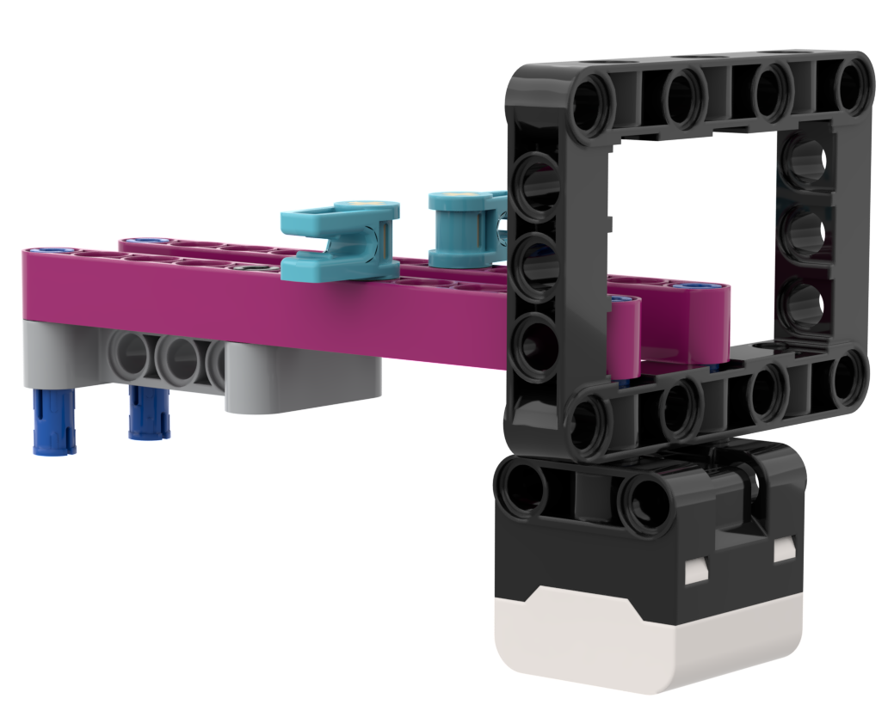
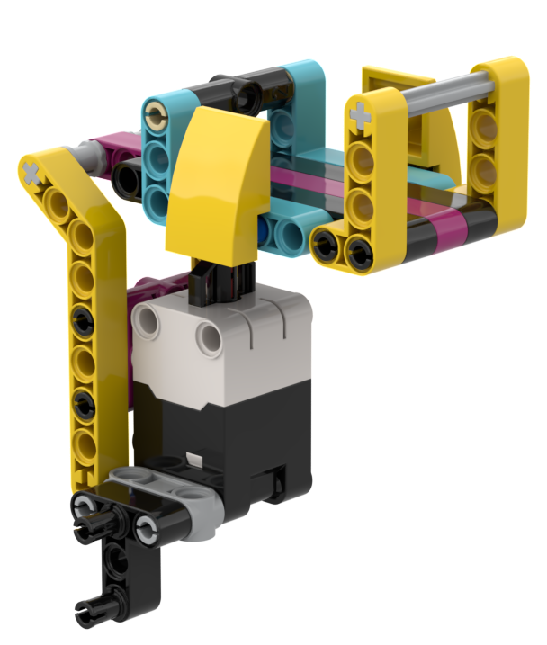
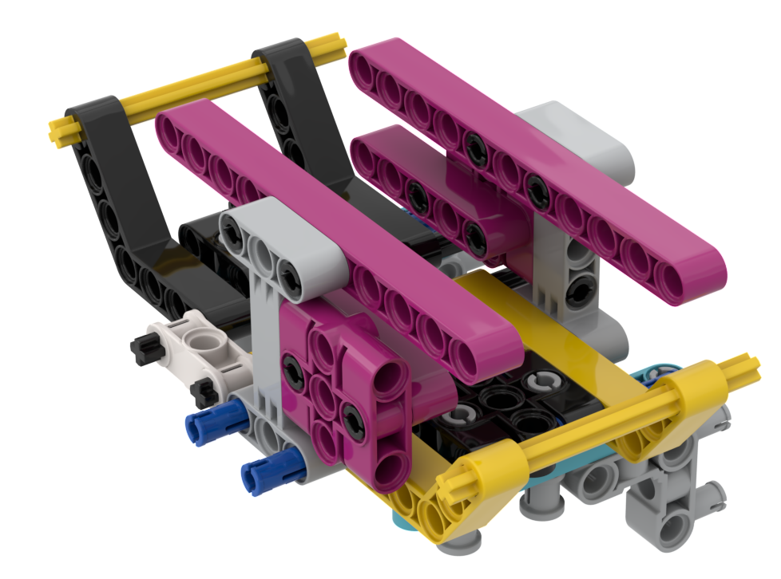
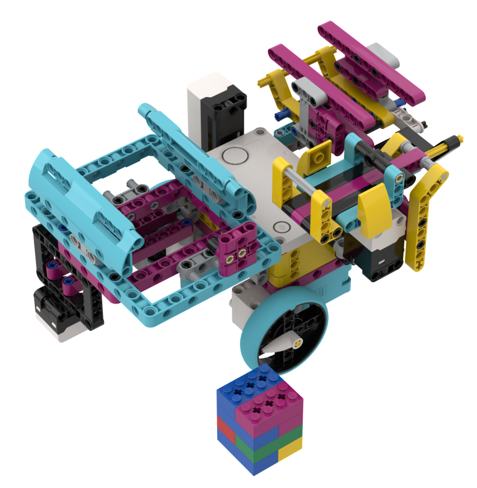
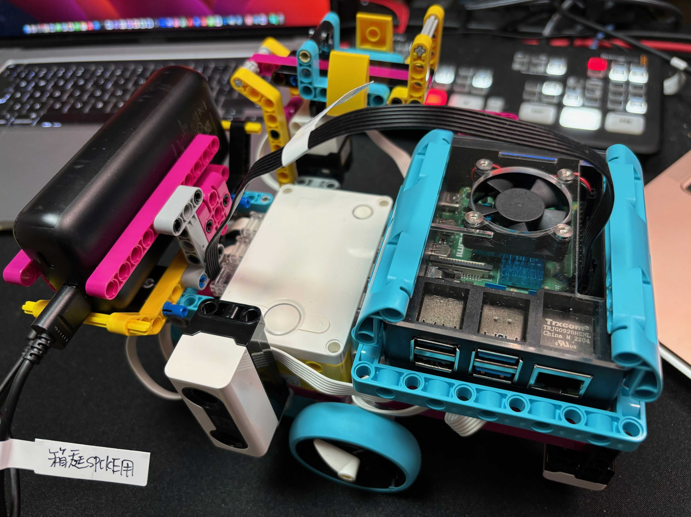

[English](link:README.html[]) | [日本語](link:README_ja.html[])

== SPIKE RasPi Transporter

[.lead]
「Spike RasPi Transporter」は、LEGO SPIKE PRIME <<spike>>  のキットとRaspberry Pi 4 <<raspi>> を使って製作した自動荷物運搬車です。

[NOTE]
****
Raspberry Pi を使わずに、SPIKE PRIMEだけで製作したものは、次のページにあります。

* https://github.com/kuboaki/spike_transporter.git[Spike Trasporterのリポジトリ, window=_blank]
****

.LEGO SPIKE PRIMEとRaspberry Piで製作した自動搬送車
image::movies_photos/spike_rasapi_transporter_left.jpeg[width="60%"]

=== 製作の動機

LEGO SPIKE PRIME のキットを使って製作した場合、SPIKEハブを使うにはSPIKEアプリケーションかPythonを使う必要があります。一方で、ETロボコン <<etrobo>> などでは、SPIKE上でTOPPERS <<toppers>> のリアルタイムOSがベースのEV3RT <<ev3rt>> を使えるようにするために、ロボット上に Raspberry Piを搭載しています。

そこで、「Spike Transporter」にRaspberry Piを搭載した自動荷物運搬車を製作してみました。

=== 自動荷物搬送車の構成

自動搬送車はいくつかのユニットで構成されています。

==== ベースユニット

ベースユニットは、2つの車輪と後部のボールで地面を走行するユニットです。
SPIKEのラージハブと2つのミディアム・モーターを使っています。

.ベースユニット
image::images/spike_raspi_transporter_base.png[width="40%"]

==== 経路監視ユニット

経路監視ユニットは、自動荷物搬送車が走行する経路（黒いライン）を監視します。
SPIKEのカラーセンサーを使っています。

.経路監視ユニット

==== 側壁監視ユニット

側壁監視ユニットは、荷物（コンテナ）の配達先の壁や回送先の車庫の壁を認識します。
SPIKEの超音波センサーを使っています。

.側壁監視ユニット
image::images/spike_raspi_transporter_walldetector.png[width="20%"]

==== 荷台とコンテナ

荷台は、荷物（コンテナ）を載せる場所です。荷物の有無を監視しています。
SPIKEのフォースセンサー（タッチセンサーの仲間）を使っています。

[cols="1,1",frame=none,grid=none]
|===
a|.荷台

a|.荷物（コンテナ）

|===

==== Raspberry Piマウンタ

Raspberry Piを載せるユニットです。使用しているケースによっては、多少の変更が必要になるでしょう。

.Raspberry Piマウンタ
image::images/spike_raspi_transporter_raspi_mounter.png[width="60%"]

==== バッテリーマウンタ

モバイルバッテリーを載せるユニットです。使用しているバッテリーによっては、多少の変更が必要になるでしょう。

.バッテリーマウンタ

==== 全体像

全部のユニットを組み合わせると、次の図のようになります。

.Spike Raspi Transporter

Raspberry Piとモバイルバッテリーを搭載すると、次の図のようになります。

[cols="1,1",frame=none,grid=none]
|===
a|.Spike Raspi Transporter(left)
image::movies_photos/spike_rasapi_transporter_left.jpeg[width="70%"]
a|.Spike Raspi Transporter(right)

|===

=== 組立図

組立図は、Bricklink Studio で作成しました。

* link:images/spike_raspi_transporter_instructions.pdf[Spike Raspi Transporterの組立図（PDF）]

.組立図のページの例
image::images/build_instruction_sample_page.png[width="80%"]

=== 開発環境とプログラム

（準備中です）

=== コンテンツの構造

[source,console]
----
spike_raspi_transporter
├── images: LEGO Studio data, images, build instruction.
└── movies_photos: movies and photos.
----

[bibliography]
=== 文献やリンク

- [[[spike]]] LEGO SPIKE PRIME
** https://education.lego.com/en-us/products/lego-education-spike-prime-set/45678/
** https://education.lego.com/ja-jp/products/-spike-/45678/
- [[[bricklink_my_page]]] Spike Transporter on "My Gallery" at BrickLink
** https://www.bricklink.com/v3/studio/design.page?idModel=541490
- [[[ev3]]] Lego Mindstorms EV3
** https://ja.wikipedia.org/wiki/Lego_Mindstorms_EV3
- [[[spike_app]]] LEGO Education SPIKE App
** https://education.lego.com/ja-jp/downloads/spike-app/software/
- [[[raspi]]] Rasbberry Pi WEB site
** https://www.raspberrypi.com/
